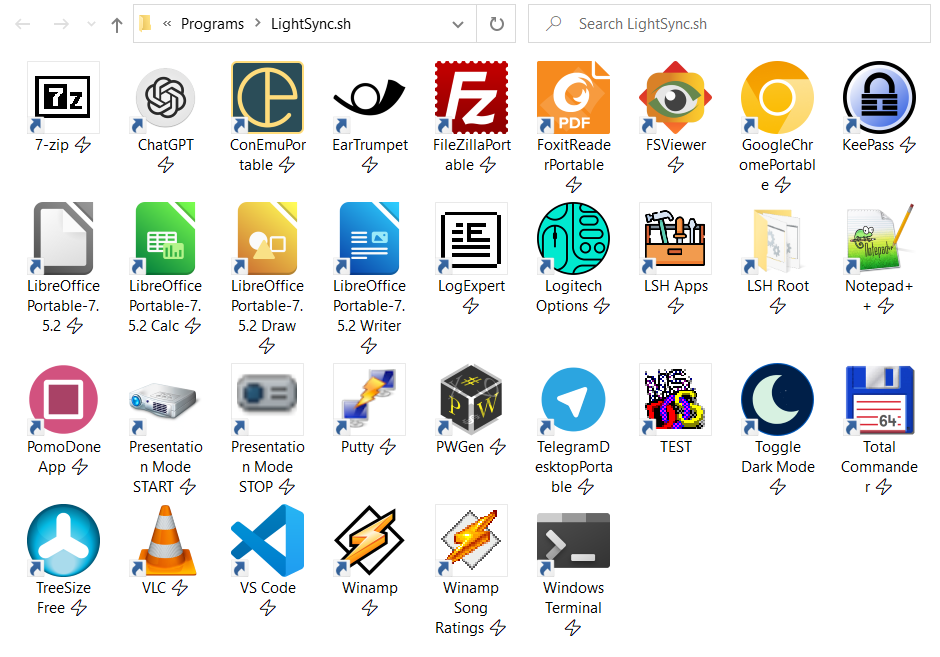

## LightSync.sh

LightSync is a Windows utility that lets you to define various config parameters as yaml files.

It can install itself as a Scheduled TAsk and run periodically.

I use this combined with Dropbox to sync my portable apps and configs across multiple machines.

This tool builds on the fuctions I published in the [useful/PS-Winhelpers](https://github.com/levid0s/useful/tree/master/ps-winhelpers) repo.

When syncing my portable apps, the 'LSH Apps' Start Menu folder gets created.

The shortcuts have a ⚡ suffix so I know they are portable.




### Supported config types

- `reg`: Windows Registry
- `assocs.assoc`: File Associations
- `assocs.verb`: File Associations - Custom verb
- `shortcuts`: Start Menu Shortcuts
- `runonce`: RunOnce commands
- `junction`: Junctions
- `symlink`: Symlinks
- `paths`: User %PATH% entries
- `dropboxignore`: Adding certain folders to Dropbox Ignore List
- `dropboxoffline`: Setting certain folders to be downloaded by Dropbox
- `folders.versionfrom`: Setting a folder comment to match a binary's version entry
- `files.state=absent`: Deleting certain files


### Usage

#### Step 1: Have some yaml files in ./packages

#### Step 2: Run Install

You'll be allowed to select the list of packages to sync periodically.

Confirm the path for the LightSync script.

```
.\LightSync.ps1 -Install

DEBUG: [ LightSync.ps1 ]: Starting LightSync
  [x] 7-zip.yaml
  [x] ChatGPT.yaml
  [x] ConEmuPortable.yaml
  [x] EarTrumpet.yaml
  [x] FileZillaPortable.yaml
  [x] FoxitReaderPortable.yaml
  [x] FSViewer.yaml
  [x] GitBashPortable.yaml
  [x] GoogleChromePortable.yaml
  [x] KeePass.yaml
  [x] LibreOfficePortable-7.5.2.yaml
  [x] LogExpert.yaml
  [x] LogitechOptions.yaml
  [x] MyTools.yaml
  [x] Notepad++.yaml
  [x] PomoDoneApp.yaml
  [x] PuttyPortable.yaml
  [x] PWGen.yaml
  [x] Python.yaml
  [x] TelegramDesktopPortable.yaml
  [x] TotalCmd.yaml
  [x] TreeSize.yaml
  [x] VLC.yaml
  [x] VS Code.yaml
  [x] Winamp.yaml
> [ ] WindowsDecrapify.yaml
  [x] WindowsTerminal.yaml


Packages     : {7-zip.yaml, ChatGPT.yaml, ConEmuPortable.yaml, EarTrumpet.yaml...}
PSPath       : Microsoft.PowerShell.Core\Registry::HKEY_CURRENT_USER\SOFTWARE\LightSync
PSParentPath : Microsoft.PowerShell.Core\Registry::HKEY_CURRENT_USER\SOFTWARE
PSChildName  : LightSync
PSDrive      : HKCU
PSProvider   : Microsoft.PowerShell.Core\Registry

Select LightSync drive and path (current: N:\Tools):
DEBUG: Adding N:\Tools\_PACKAGES to User PATH
DEBUG: >> [ Add-UserPaths ]: Paths `N:\Tools\_PACKAGES` already present, no changes needed.

Actions            : {MSFT_TaskExecAction}
Author             :
Date               :
Description        : Light User Profile Syncing Project for user Lev
Documentation      :
Principal          : MSFT_TaskPrincipal2
SecurityDescriptor :
Settings           : MSFT_TaskSettings3
Source             :
State              : Ready
TaskName           : LightSync.sh - Lev
TaskPath           : \
Triggers           : {MSFT_TaskDailyTrigger}
URI                : \LightSync.sh - Lev
Version            :
PSComputerName     :

Actions            : {MSFT_TaskExecAction}
Author             :
Date               :
Description        : Light User Profile Syncing Project for user Lev
Documentation      :
Principal          : MSFT_TaskPrincipal2
SecurityDescriptor :
Settings           : MSFT_TaskSettings3
Source             :
State              : Ready
TaskName           : LightSync.sh - Lev
TaskPath           : \
Triggers           : {MSFT_TaskDailyTrigger}
URI                : \LightSync.sh - Lev
Version            :
PSComputerName     :

```

#### Step 3: Manual Sync

An ad-hoc sync of a package file can also be performed.

In this mode a scheduled task will not be installed.

```
.\LightSync.ps1 -PackageFile .\packages\7-zip.yaml
```

All package files can be synced as well:

```
./LightSync.ps1
```


### Recommended use with Dropbox

I'm using the following process to sync my portable apps and configs across multiple machines using Dropbox.

#### Step 1: Install Dropbox

#### Step 2: Create a substed drive

It is a good idea to abstract out the Dropbox's path, because this often changes between machines.

Subst is a built-in Windows tool that can do this.

eg:
```
subst N: "C:\Users\Lev\Dropbox\"
```
You can put this script in the `shell:startup` folder.

One caveat is that any elevated process will not have access to a substed path by default, unless you re-run the subst command as admin also.


#### Step 3: Install any portable apps

Install your portable apps under the virtual `N:\Tools` path.

This will get synced by dropbox.

#### Step 4: Clone the 'LightSync' and 'useful' repos

Clone the two repos into the same parent.

It's best to put these on the `N:` drive as well, such as the yaml files will get synced automatically.

```
mkdir n:\src
cd n:\src

git clone https://github.com/levid0s/useful.git
git clone https://github.com/levid0s/LightSync.ps1.git
```

### Step 5: Install LightSync as a scheduled task

```
LightSync.ps1 -Install
```

